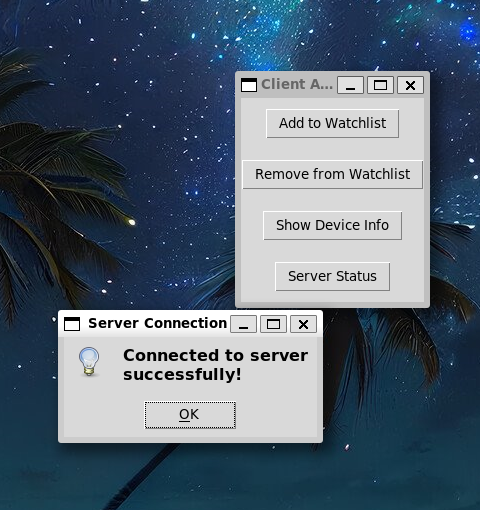
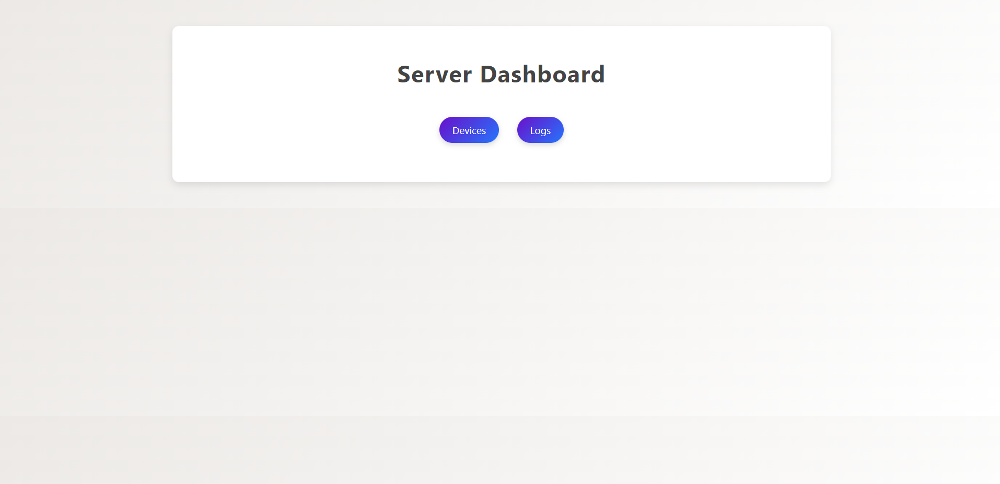
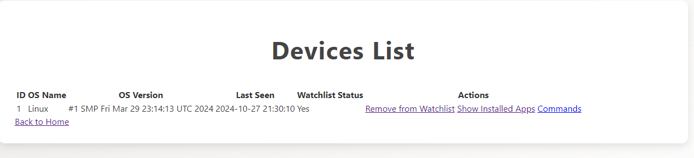
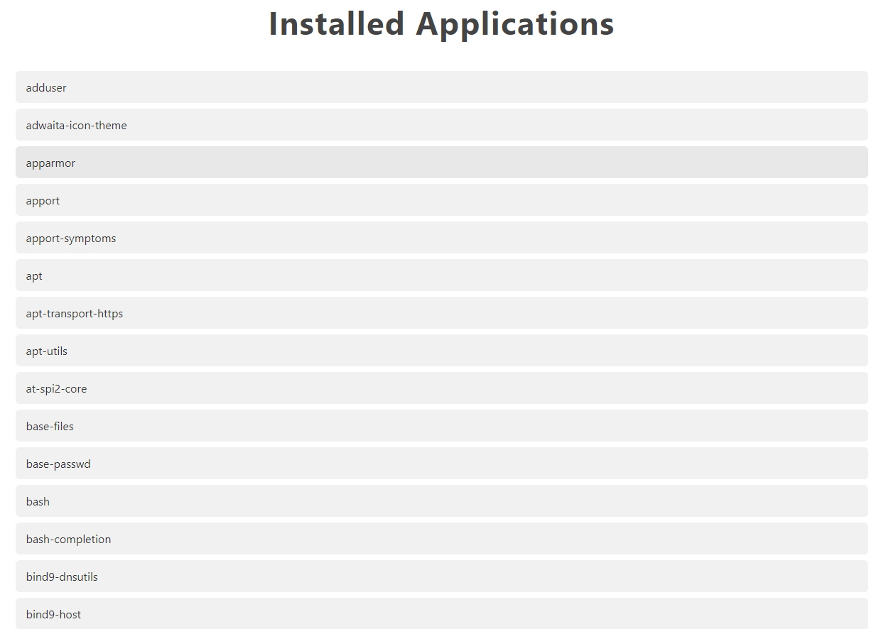

# C2 Security Application

## Introduction

This project is a Security Application that allows for the monitoring of devices, their status on a watchlist, command execution, and retrieving information like installed applications. The client communicates with the server dynamically, keeping track of devices in a secure environment. Additionally, an enhanced server UI allows the admin to manage and monitor devices efficiently.

Some pictures for the project










## Architecture Overview (optional)

The architecture follows a client-server model:
- **Client-side**: The client app runs on devices, dynamically sending device information and handling commands issued by the server.
- **Server-side**: The server app manages the watchlist, logs interactions, and executes commands via a web-based admin interface.

## How to Use

### Prerequisites
- **Python 3.10** or higher
- **Flask** framework
- **SocketIO** for real-time communication
- **SQLite** as the database for device and log management

Install dependencies using:
```bash
pip install -r requirements.txt
```

### Build
The project structure:
1. **Client**: The client folder contains the device-side application.
2. **Server**: The server folder hosts the server application with the admin interface.

No explicit build steps needed beyond setting up dependencies.

### Test
The C2 Security Application project does not include automated unit or integration tests at this time. Instead, debugging and testing are performed manually through the console during development.

### Run

*********************
**ONLY FIRST TIME**
```bash
cd server
sqlite3 db.sqlite
```
*********************

To run the server:
```bash
cd server
python app.py
```

To run the client:
```bash
cd client
python client.py
```

## License

Copyright (c) [2024] [Maen Zohori]

Permission is hereby granted, free of charge, to any person obtaining a copy
of this software and associated documentation files (the "Software"), to deal
in the Software without restriction, including without limitation the rights
to use, copy, modify, merge, publish, distribute, sublicense, and/or sell
copies of the Software, and to permit persons to whom the Software is
furnished to do so, subject to the following conditions:

The above copyright notice and this permission notice shall be included in all
copies or substantial portions of the Software.

THE SOFTWARE IS PROVIDED "AS IS", WITHOUT WARRANTY OF ANY KIND, EXPRESS OR
IMPLIED, INCLUDING BUT NOT LIMITED TO THE WARRANTIES OF MERCHANTABILITY,
FITNESS FOR A PARTICULAR PURPOSE AND NONINFRINGEMENT. IN NO EVENT SHALL THE
AUTHORS OR COPYRIGHT HOLDERS BE LIABLE FOR ANY CLAIM, DAMAGES OR OTHER
LIABILITY, WHETHER IN AN ACTION OF CONTRACT, TORT OR OTHERWISE, ARISING FROM,
OUT OF OR IN CONNECTION WITH THE SOFTWARE OR THE USE OR OTHER DEALINGS IN THE
SOFTWARE.